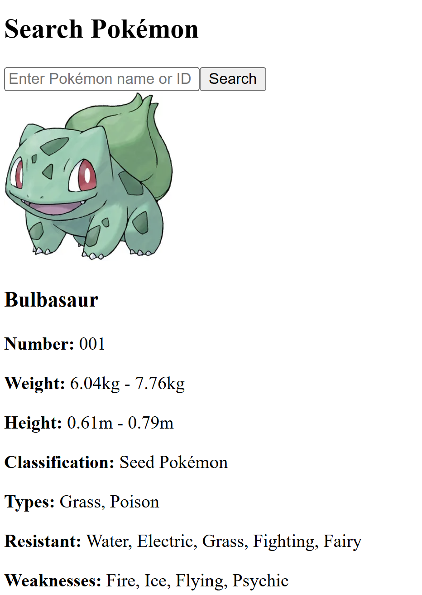

# Pokémon Search and Details App



## Project Overview

This project is a web application built with **React**, **Apollo Client**, and **GraphQL** that allows users to search for Pokémon by their name or ID. Upon searching, the app retrieves detailed information about the selected Pokémon using the **Pokémon API** and displays key attributes such as name, type, weight, height, attacks, and evolutions.

### Key Features:
- **Pokémon Search**: Users can search for Pokémon by name or ID.
- **Detailed Information**: Displays detailed information about the selected Pokémon, such as its classification, types, resistances, weaknesses, attacks, and evolutions.
- **Evolution Navigation**: Users can click on a Pokémon's evolutions to view more details about them.

## Technologies Used:
- **React**: Frontend framework to build the user interface.
- **Apollo Client**: To fetch data from the GraphQL API.
- **GraphQL**: API query language to retrieve Pokémon data.

## Setup Instructions

1. **Clone the repository**:
    ```bash
    git clone <repo-url>
    cd <project-directory>
    ```

2. **Install dependencies**:
    ```bash
    npm install
    ```

3. **Start the application**:
    ```bash
    npm start
    ```

## Test Cases
Test Pokémon: Bulbasaur, Squirtle, and Charmander
For the testing of the search functionality, three Pokémon were used as test cases:

- Bulbasaur (ID: UG9rZW1vbjowMDE=)
- Squirtle (ID: UG9rZW1vbjowMDc=)
- Charmander (ID: UG9rZW1vbjowMDQ=)
